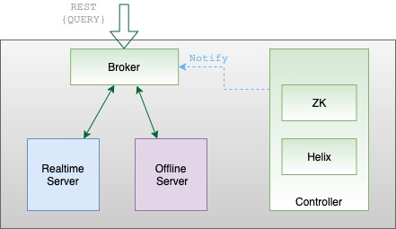
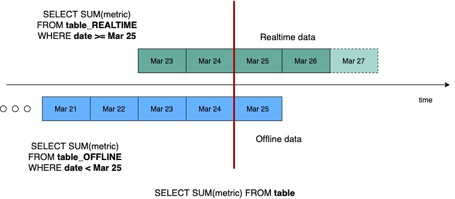

# Broker

Brokers handle Pinot queries. They** accept queries from clients and forward them to the right servers**. They collect results back from the servers and **consolidate them into a single response**, to **send back to the client**.



Pinot Brokers are modeled as **Spectators**. They need to know the location of each segment of a table (and each replica of the segments) and route requests to the appropriate server that hosts the segments of the table being queried.&#x20;

The broker ensures that all the rows of the table are queried exactly once so as to return correct, consistent results for a query. The brokers may optimize to** prune some of the segments** as long as accuracy is not sacrificed.&#x20;

Helix provides the framework by which spectators can learn the location in which each partition of a resource (_i.e._ participant) resides. The brokers use this mechanism to learn the servers that host specific segments of a table.

In the case of hybrid tables, the brokers ensure that the overlap between real-time and offline segment data is queried exactly once, by performing **offline and real-time federation**.&#x20;

\
Let's take this example, we have real-time data for 5 days - March 23 to March 27, and offline data has been pushed until Mar 25, which is 2 days behind real-time. The brokers maintain this time boundary.&#x20;



Suppose, we get a query to this table : `select sum(metric) from table`. The broker will split the query into 2 queries based on this time boundary - one for offline and one for realtime. This query becomes - `select sum(metric) from table_REALTIME where date >= Mar 25`\
and `select sum(metric) from table_OFFLINE where date < Mar 25`&#x20;

\
The broker merges results from both these queries before returning the result to the client.

## Starting a Broker

Make sure you've [setup Zookeeper](cluster.md#setup-a-pinot-cluster). If you're using docker, make sure to [pull the pinot docker image](cluster.md#setup-a-pinot-cluster). To start a broker&#x20;



```
docker run \
    --network=pinot-demo \
    --name pinot-broker \
    -d ${PINOT_IMAGE} StartBroker \
    -zkAddress pinot-zookeeper:2181
```



```
bin/pinot-admin.sh StartBroker \
  -zkAddress localhost:2181 \
  -clusterName PinotCluster \
  -brokerPort 7000
```


