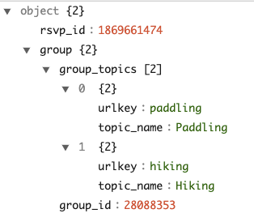
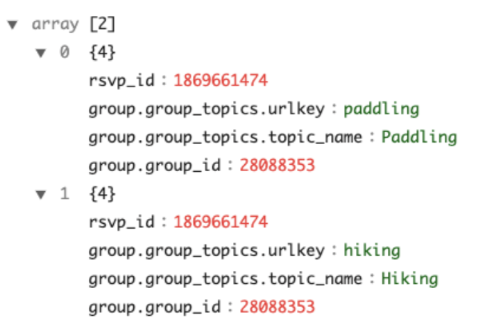

# Complex Type (Array, Map) Handling

It's common for the ingested data to have complex structure. For example, Avro schema has [records](https://avro.apache.org/docs/current/spec.html#schema\_record) and [arrays](https://avro.apache.org/docs/current/spec.html#Arrays), and JSON data has [objects](https://json-schema.org/understanding-json-schema/reference/object.html) and [arrays](https://json-schema.org/understanding-json-schema/reference/array.html). In Apache Pinot, the data model supports primitive data types (including int, long, float, double, string, bytes), as well as limited multi-value types such as an array of primitive types. Such simple data types allow Pinot to build fast indexing structures for good query performance, but it requires some handling on the complex structures. There are in general two options for such handling: convert the complex-type data into JSON string and then build JSON index; or use the inbuilt complex-type handling rules in the ingestion config.

In this page, we'll show how to handle this complex-type structure with these two approaches, to process the example data in the following figure, which is a field `group` from the [Meetup events Quickstart example](https://github.com/apache/pinot/tree/master/pinot-tools/src/main/resources/examples/stream/meetupRsvp). Note this object has two child fields, and the child `group` is a nested array with the element of object type.



## Handle the complex type with JSON indexing

Apache Pinot provides powerful [JSON index](../indexing/json-index.md) to accelerate the value lookup and filtering for the column. To convert an object `group` with complex type to JSON, you can add the following config to table config.


```javascript
{
  "transformConfigs": [
      {
        "columnName": "group_json",
        "transformFunction": "jsonFormat(\"group\")"
      }
    ],
    ...
    "tableIndexConfig": {
    "loadMode": "MMAP",
    "noDictionaryColumns": [
      "group_json"
    ],
    "jsonIndexColumns": [
      "group_json"
    ]
  },

}
```


Note the config `transformConfigs` transforms the object `group` to a JSON string `group_json`, which then creates the JSON indexing with config `jsonIndexColumns`. To read the full spec, please check out this [file](https://github.com/apache/pinot/blob/master/pinot-tools/src/main/resources/examples/stream/meetupRsvp/json\_meetupRsvp\_realtime\_table\_config.json). Also note that `group` is a reserved keyword in SQL, and that's why it's quoted in the `transformFunction`.

Additionall, you need to overwrite the `maxLength` of the field `group_json` on the schema, because by default, a string column has a limited length. For example,


```javascript
{
  {
      "name": "group_json",
      "dataType": "STRING",
      "maxLength": 2147483647
    }
    ...
}
```


For the full spec, please check out this [file](https://github.com/apache/pinot/blob/master/pinot-tools/src/main/resources/examples/stream/meetupRsvp/json\_meetupRsvp\_schema.json).

With this, you can start to query the nested fields under `group`. For the deatils about the supported JSON function, please check out this [guide](../indexing/json-index.md)).

## Handle the complex type with ingestion configurations

Though JSON indexing is a handy way to process the complex types, there are some limitations:

* It’s not performant to group by or order by a JSON field, because `JSON_EXTRACT_SCALAR` is needed to extract the values in the GROUP BY and ORDER BY clauses, which invokes the function evaluation.
* For cases that you want to use Pinot's [multi-column functions](https://docs.pinot.apache.org/users/user-guide-query/supported-aggregations#multi-value-column-functions) such as `DISTINCTCOUNTMV`

Alternatively, from Pinot 0.8, you can use the complex-type handling in ingestion configurations to flatten and unnest the complex structure and convert them into primitive types. Then you can reduce the complex-type data into a flattened Pinot table, and query it via SQL. With the inbuilt processing rules, you do not need to write ETL jobs in another compute framework such as Flink or Spark.

To process this complex-type, you can add the configuration `complexTypeConfig` to the `ingestionConfig`. For example:


```javascript
{
  "ingestionConfig": {    
    "complexTypeConfig": {
      "delimiter": '.',
      "fieldsToUnnest": ["group.group_topics"],
      "collectionNotUnnestedToJson": "NON_PRIMITIVE"
    }
  }
}
```


With the `complexTypeConfig` , all the map objects will be flattened to direct fields automatically. And with `unnestFields` , a record with the nested collection will unnest into multiple records. For instance, the example in the beginning will transform into two rows with this configuration example.



Note that

* The nested field `group_id` under `group` is flattened to field `group.group_id`. The default value of the delimiter is `.`, you can choose other delimiter by changing the configuration `delimiter` under `complexTypeConfig`. This flattening rule also apllies on the maps in the collections to be unnested.
* The nested array `group_topics` under `group` is unnested into the top-level, and convert the output to a collection of two rows. Note the handling of the nested field within `group_topics`, and the eventual top-level field of `group.group_topics.urlkey`. All the collections to unnest shall be included in configuration `fieldsToUnnest`.
* For the collections not in specified in `fieldsToUnnest`,  the ingestion by default will serialize them into JSON string, except for the array of primitive values, which will be ingested as multi-value column by default. The behavior is defined in config `collectionNotUnnestedToJson` with default value to `NON_PRIMITIVE`. Other behaviors include (1) `ALL`, which aslo convert the array of primitive values to JSON string; (2) `NONE`, this does not do conversion, but leave it to the users to use transform functions for handling.

You can find the full spec of the table config [here](https://github.com/apache/pinot/blob/master/pinot-tools/src/main/resources/examples/stream/meetupRsvp/complexTypeHandling\_meetupRsvp\_realtime\_table\_config.json) and the table schema [here](https://github.com/apache/pinot/blob/master/pinot-tools/src/main/resources/examples/stream/meetupRsvp/complexTypeHandling\_meetupRsvp\_schema.json).

With the flattening/unnesting, you can then query the table with primitive values using the SQL query like:

```sql
SELECT "group.group_topics.urlkey", "group.group_topics.topic_name", "group.group_id" 
FROM meetupRsvp
LIMIT 10
```

Note `.` is a reserved character in SQL, so you need to quote the flattened column.

### Infer the Pinot schema from the Avro schema and JSON data

When there are complex structures, it could be challenging and tedious to figure out the Pinot schema manually. To help the schema inference, Pinot provides utility tools to take the Avro schema or JSON data as input and output the inferred Pinot schema.

To infer the Pinot schema from Avro schema, you can use the command like the following

```bash
bin/pinot-admin.sh AvroSchemaToPinotSchema -timeColumnName fields.hoursSinceEpoch -avroSchemaFile /tmp/test.avsc -pinotSchemaName myTable -outputDir /tmp/test -fieldsToUnnest entries
```

Note you can input configurations like `fieldsToUnnest` similar to the ones in `complexTypeConfig`. And this will simulate the complex-type handling rules on the Avro schema and output the Pinot schema in the file specified in `outputDir`.

Similarly, you can use the command like the following to infer the Pinot schema from a file of JSON objects.

```bash
bin/pinot-admin.sh JsonToPinotSchema -timeColumnName hoursSinceEpoch -jsonFile /tmp/test.json -pinotSchemaName myTable -outputDir /tmp/test -fieldsToUnnest payload.commits
```

You can check out an example of this run in this [PR](https://github.com/apache/pinot/pull/6930).
