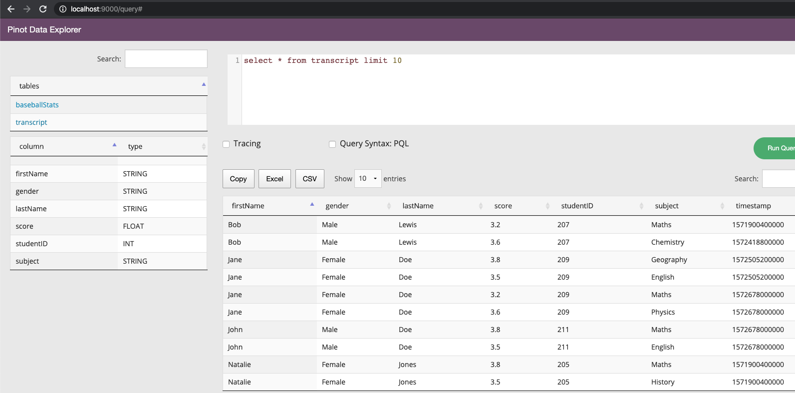

# Stream ingestion example

So far, we setup our cluster, ran some queries on the demo tables and explored the admin endpoints. We also uploaded some sample batch data for transcript table. 

Now, it's time to ingest from a sample stream into Pinot.

## Data Stream

First, we need to setup a stream. Pinot has out-of-the-box realtime ingestion support for Kafka. Other streams can be plugged in, more details in [Pluggable Streams](../../plugins/write-custom-plugins/write-your-stream.md). 

Let's setup a demo Kafka cluster locally, and create a sample topic `transcript-topic`



**Start Kafka**

```
docker run \
	--network pinot-demo --name=kafka \
	-e KAFKA_ZOOKEEPER_CONNECT=pinot-quickstart:2123/kafka \
	-e KAFKA_BROKER_ID=0 \
	-e KAFKA_ADVERTISED_HOST_NAME=kafka \
	-d wurstmeister/kafka:latest
```

**Create a Kafka Topic**

```text
docker exec \
  -t kafka \
  /opt/kafka/bin/kafka-topics.sh \
  --zookeeper pinot-quickstart:2123/kafka \
  --partitions=1 --replication-factor=1 \
  --create --topic transcript-topic
```



**Start Kafka**

Start Kafka cluster on port `9876` using the same Zookeeper from the quick-start examples

```text
bin/pinot-admin.sh  StartKafka -zkAddress=localhost:2123/kafka -port 9876
```

**Create a Kafka topic**

Download the latest [Kafka](https://kafka.apache.org/quickstart#quickstart_download). Create a topic

```css
bin/kafka-topics.sh --create --bootstrap-server localhost:9876 --replication-factor 1 --partitions 1 --topic transcript-topic
```



## Creating a Schema

If you followed the [Batch upload sample data](pushing-your-data-to-pinot.md), you have already pushed a schema for your sample table. If not, head over to [Creating a schema](pushing-your-data-to-pinot.md#creating-a-schema) on that page, to learn how to create a schema for your sample data.

## Creating a table config

If you followed [Batch upload sample data](pushing-your-data-to-pinot.md), you learnt how to push an offline table and schema. Similar to the offline table config, we will create a realtime table config for the sample. Here's the realtime table config for the transcript table. For a more detailed overview about table, checkout [Table](../components/table.md).


```javascript
{
  "tableName": "transcript",
  "tableType": "REALTIME",
  "segmentsConfig": {
    "timeColumnName": "timestampInEpoch",
    "timeType": "MILLISECONDS",
    "schemaName": "transcript",
    "replicasPerPartition": "1"
  },
  "tenants": {},
  "tableIndexConfig": {
    "loadMode": "MMAP",
    "streamConfigs": {
      "streamType": "kafka",
      "stream.kafka.consumer.type": "lowlevel",
      "stream.kafka.topic.name": "transcript-topic",
      "stream.kafka.decoder.class.name": "org.apache.pinot.plugin.stream.kafka.KafkaJSONMessageDecoder",
      "stream.kafka.consumer.factory.class.name": "org.apache.pinot.plugin.stream.kafka20.KafkaConsumerFactory",
      "stream.kafka.broker.list": "localhost:9876",
      "realtime.segment.flush.threshold.time": "3600000",
      "realtime.segment.flush.threshold.size": "50000",
      "stream.kafka.consumer.prop.auto.offset.reset": "smallest"
    }
  },
  "metadata": {
    "customConfigs": {}
  }
}
```


## Uploading your schema and table config

Now that we have our table and schema, let's upload them to the cluster. As soon as the realtime table is created, it will begin ingesting from the Kafka topic.



```bash
docker run \
    --network=pinot-demo \
    -v /tmp/pinot-quick-start:/tmp/pinot-quick-start \
    --name pinot-streaming-table-creation \
    apachepinot/pinot:latest AddTable \
    -schemaFile /tmp/pinot-quick-start/transcript-schema.json \
    -tableConfigFile /tmp/pinot-quick-start/transcript-table-realtime.json \
    -controllerHost pinot-quickstart \
    -controllerPort 9000 \
    -exec
```



```
bin/pinot-admin.sh AddTable \
    -schemaFile /tmp/pinot-quick-start/transcript-schema.json \
    -tableConfigFile /tmp/pinot-quick-start/transcript-table-realtime.json \
    -exec
```



## Loading sample data into stream

Here's a JSON file for transcript table data:


```css
{"studentID":205,"firstName":"Natalie","lastName":"Jones","gender":"Female","subject":"Maths","score":3.8,"timestampInEpoch":1571900400000}
{"studentID":205,"firstName":"Natalie","lastName":"Jones","gender":"Female","subject":"History","score":3.5,"timestampInEpoch":1571900400000}
{"studentID":207,"firstName":"Bob","lastName":"Lewis","gender":"Male","subject":"Maths","score":3.2,"timestampInEpoch":1571900400000}
{"studentID":207,"firstName":"Bob","lastName":"Lewis","gender":"Male","subject":"Chemistry","score":3.6,"timestampInEpoch":1572418800000}
{"studentID":209,"firstName":"Jane","lastName":"Doe","gender":"Female","subject":"Geography","score":3.8,"timestampInEpoch":1572505200000}
{"studentID":209,"firstName":"Jane","lastName":"Doe","gender":"Female","subject":"English","score":3.5,"timestampInEpoch":1572505200000}
{"studentID":209,"firstName":"Jane","lastName":"Doe","gender":"Female","subject":"Maths","score":3.2,"timestampInEpoch":1572678000000}
{"studentID":209,"firstName":"Jane","lastName":"Doe","gender":"Female","subject":"Physics","score":3.6,"timestampInEpoch":1572678000000}
{"studentID":211,"firstName":"John","lastName":"Doe","gender":"Male","subject":"Maths","score":3.8,"timestampInEpoch":1572678000000}
{"studentID":211,"firstName":"John","lastName":"Doe","gender":"Male","subject":"English","score":3.5,"timestampInEpoch":1572678000000}
{"studentID":211,"firstName":"John","lastName":"Doe","gender":"Male","subject":"History","score":3.2,"timestampInEpoch":1572854400000}
{"studentID":212,"firstName":"Nick","lastName":"Young","gender":"Male","subject":"History","score":3.6,"timestampInEpoch":1572854400000}
```


Push sample JSON into Kafka topic, using the Kafka script from the Kafka download

```css
bin/kafka-console-producer.sh \
    --broker-list localhost:9876 \
    --topic transcript-topic < /tmp/pinot-quick-start/rawData/transcript.json
```

## Ingesting streaming data

As soon as data flows into the stream, the Pinot table will consume it and it will be ready for querying. Head over to the [Query Console ](http://localhost:9000/query)to checkout the realtime data



