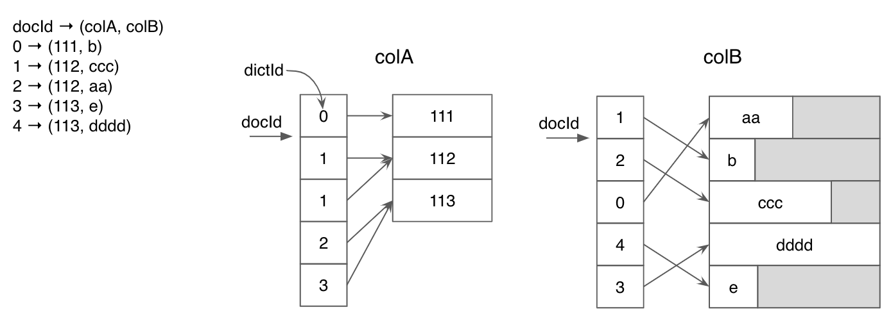
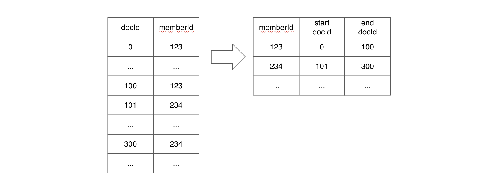

# Forward Index

The values for every column are stored in a forward index, of which there are three types:

* [Dictionary encoded forward index](forward-index.md#dictionary-encoded-forward-index-with-bit-compression-default)\
  Builds a dictionary mapping 0 indexed ids to each unique value in a column and a forward index that contains the bit-compressed ids.
* [Raw value forward index](forward-index.md#raw-value-forward-index)\
  Builds a forward index of the column's values.
* [Sorted forward index](forward-index.md#sorted-forward-index-with-run-length-encoding)\
  Builds a dictionary mapping from each unique value to a pair of start and end document id and a forward index on top of the dictionary encoding.

## Dictionary-encoded forward index with bit compression (default)

Each unique value from a column is assigned an id and a dictionary is built that maps the id to the value. The forward index stores bit-compressed ids instead of the values. If you have few unique values, dictionary-encoding can significantly improve space efficiency.

The below diagram shows the dictionary encoding for two columns with `integer` and `string` types. For`colA`, dictionary encoding saved a significant amount of space for duplicated values.

On the other hand, `colB` has no duplicated data. Dictionary encoding will not compress much data in this case where there are a lot of unique values in the column. For the `string` type, we pick the length of the longest value and use it as the length for the dictionary’s fixed-length value array. The padding overhead can be high if there are a large number of unique values for a column.



## Raw value forward index

The raw value forward index directly stores values instead of ids.

Without the dictionary, the dictionary lookup step can be skipped for each value fetch. The index can also take advantage of the good locality of the values, thus improving the performance of scanning a large number of values.

The raw value forward index works well for columns that have a large number of unique values where a dictionary does not provide much compression.

As seen in the above diagram, using dictionary encoding will require a lot of random accesses of memory to do those dictionary look-ups. With a raw value forward index, we can scan values sequentially, which can result in improved query performance when applied appropriately.


A raw value forward index can be configured for a table by configuring the [table config](../../configuration-reference/table.md), as shown below:

```javascript
{
    "tableIndexConfig": {
        "noDictionaryColumns": [
            "column_name",
            ...
        ],
        ...
    }
}
```

## Sorted forward index with run-length encoding

When a column is physically sorted, Pinot uses a sorted forward index with run-length encoding on top of the dictionary-encoding. Instead of saving dictionary ids for each document id, we store a pair of start and end document id for each value.



(For simplicity, this diagram does not include dictionary encoding layer.)

Sorted forward index has the advantages of both good compression and data locality. Sorted forward index can also be used as inverted index.

A sorted index can be configured for a table by setting it in the table config:

```javascript
{
    "tableIndexConfig": {
        "sortedColumn": [
            "column_name"
        ],
        ...
    }
}
```


**Note**: A Pinot table can only have 1 sorted column


### Real-time ingestion

Real-time data ingestion will sort data by the `sortedColumn` when generating segments, so you don't need to pre-sort the data.

### Offline ingestion

For offline data ingestion, you will need to sort the data before ingesting it into Pinot. If you are ingesting multiple segments you will need to make sure that data is sorted within each segment - you don't need to sort the data across segments.

### Checking sort status

You can check the sorted status of a column in a segment by running the following:

```bash
$ grep memberId <segment_name>/v3/metadata.properties | grep isSorted
column.memberId.isSorted = true
```
