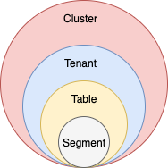

# Concepts

Pinot is designed to deliver low latency queries on large datasets. In order to achieve this performance, Pinot stores the data in a columnar format and adds additional indices to perform fast filtering, aggregation and group by.

Raw data is broken into small data chunks and each chunk is converted into a unit known as Segment. One or more segments together form a table. All queries are run against a table. 

## Pinot Entity Model

In order to understand the concepts, let's start with how data is stored in Pinot. 

**Table**

Similar to traditional databases, Pinot has the concept of **table** - logical abstraction to refer to a collection of related data. It consists of columns and rows \(documents\). Typically, a  table is associated with a schema which lists the columns in the table and their data types.

**Segment**  
Pinot has a distributed architecture and scales horizontally. Pinot expects the size of a table to grow infinitely over time. In order to achieve this, the entire data needs to  be distributed across multiple nodes. Pinot achieve this by breaking the data into smaller chunks know as **segment** \(this is similar to shards/partitions in relational databases\). Segments can also be seen as time based partitions. 

**Tenant**  
In order to support multi-tenancy, Pinot has first class support for tenants. A table is associated with a tenant. This allows all tables belonging to a particular use case to be grouped under a single tenant name. By default, all tables belong a default tenant name called, you guessed it, "default". The concept of tenants is very important when the multiple use cases are use Pinot and there is a need to provide quotas or some sort of isolation across tenants. For e.g. one can restrict all segments of table T1 to reside only on nodes N1, N2 and N3.

**Cluster**  
Logically, Cluster is simply a group of tenants. Cluster is also a set a nodes \(more on this later\). Typically, there is only cluster per environment/data center. There is no needed to create multiple Pinot clusters since Pinot supports the concept of tenants. At LinkedIn, the largest Pinot cluster consists of 1000+ nodes. 

## Pinot Components

Pinot cluster is comprises of multiple components - Controller, Server, Broker, Minion\(optional\). Apart from these, Pinot uses Zookeeper and Helix for coordination. 

### Pinot Controller

Pinot controller is the core component that manages all other components. It has visibility into all the nodes in the cluster and reacts to changes such as adding a table, segment, node etc. Helix controller is embedded within Pinot Controller. Controller provides an admin interface\(rest\) to manage and operate the cluster. See  [Controller](../pinot-components/controller.md) for more details. 

### Pinot Broker

Accepts queries from clients and routes them to one or more pinot servers, and returns consolidated response to the client. See [Broker](../pinot-components/broker.md) for more details.

### Pinot Server

Pinot servers hosts the pinot segments. Pinot servers are designed to scale horizontally. Pinot server can either be a realtime server or offline server. See [Server](../pinot-components/server.md) for more details.

### _Pinot Minion_

Pinot minion is an optional component that can be used to run background tasks such as Purge tasks for GDPR \(General Data Protection Regulation\), optimizing pinot segments, building additional indices, etc. One can also, write a custom task that run's periodically. While it's possible to perform these tasks on the Pinot Servers, having a separate process allows one to perform these tasks without impacting the query latency.

