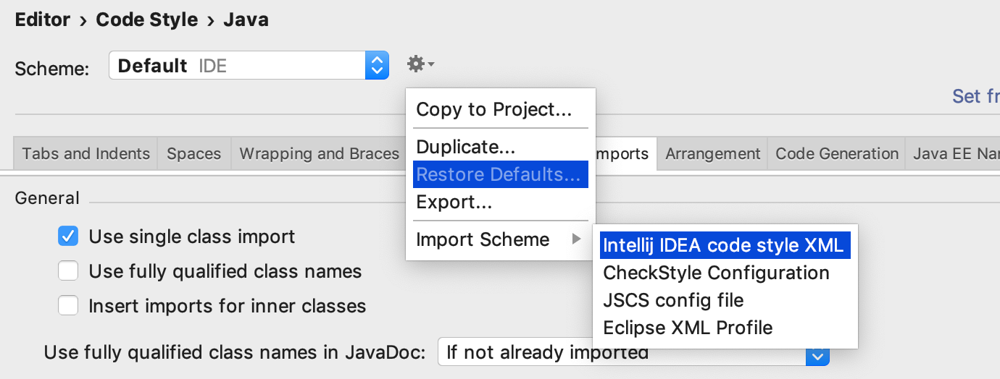
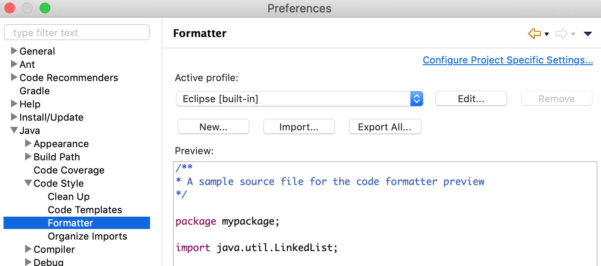

# Code Setup

## Dev Environment Setup

To contribute to Pinot, please follow the instructions below.

### Git

Pinot uses git for source code management. If you are new to Git, it will be good to review [basics](https://git-scm.com/book/en/v1/Getting-Started-Git-Basics) of Git and a common tasks like [managing branches](https://git-scm.com/book/en/v2/Git-Branching-Branches-in-a-Nutshell) and [rebasing](https://git-scm.com/book/en/v2/Git-Branching-Rebasing).

### Getting the Source Code

#### Create a fork

To limit the number of branches created on the Apache Pinot repository, we recommend that you create a fork by clicking on the fork button [in this page](https://github.com/apache/incubator-pinot). Read more about [fork workflow here](https://www.atlassian.com/git/tutorials/comparing-workflows/forking-workflow)

#### Clone the repository locally

```text
$ mkdir workspace
$ cd workspace
$ git clone git@github.com:<github username>/pinot.git
$ cd pinot
# set upstream
$ git remote add upstream https://github.com/apache/incubator-pinot
# check that the upstream shows up correctly
$ git remote -v
```

### Maven

Pinot is a Maven project and familiarity with Maven will help you work with Pinot code. If you are new to Maven, you can read about Maven [here](https://maven.apache.org/) and [get a quick overview here](http://maven.apache.org/guides/getting-started/maven-in-five-minutes.html).

Run the following maven command to setup the project.

```text
# compile, download sources
$mvn install package -DskipTests -Pbin-dist -DdownloadSources -DdownloadJavadocs
```

### Setup IDE

Import the project into your favorite IDE. Setup stylesheet according to your IDE. We have provided instructions for intellij and eclipse. If you are using other IDEs, please ensure you use stylesheet based on [this](https://github.com/apache/incubator-pinot/blob/master/config/codestyle-intellij.xml).

#### Intellij

To import the Pinot stylesheet this launch intellij and navigate to `Preferences` \(on Mac\) or `Settings` on Linux.

* Navigate to `Editor` -&gt; `Code Style` -&gt; `Java`
* Select `Import Scheme` -&gt; `Intellij IDES code style XML`
* Choose `codestyle-intellij.xml` from `incubator-pinot/config` folder of your workspace. Click Apply.



#### Eclipse

To import the Pinot stylesheet this launch eclipse and navigate to `Preferences` \(on Mac\) or `Settings` on Linux.

* Navigate to Java-&gt;Code Style-&gt;Formatter
* Choose `codestyle-eclipse.xml` from `incubator-pinot/config folder` of your workspace. Click Apply.



