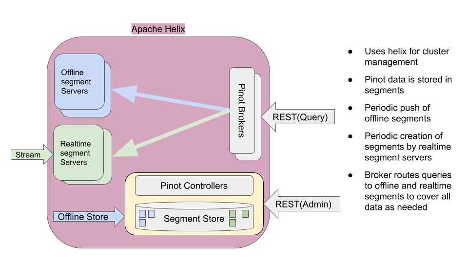

# Pinot Architecture

## Terminology

First, a bit of naming notions. Pinot has has different components, and different ways of representing the data. In particular, data is represented by:

### _Table_

A table is a logical abstraction to refer to a collection of related data. It consists of columns and rows \(documents\).

### _**Segment**_

Data in table is divided into \(horizontal\) shards referred to as segments.

## Pinot Components

### _Pinot Controller_

Manages other pinot components \(brokers, servers\) as well as controls assignment of tables/segments to servers.

### _Pinot Server_

Hosts one or more segments and serves queries from those segments_._

### _Pinot Broker_

Accepts queries from clients and routes them to one or more servers, and returns consolidated response to the client.

Pinot leverages [Apache Helix](http://helix.apache.org/) for cluster management. Helix is a cluster management framework to manage replicated, partitioned resources in a distributed system. Helix uses Zookeeper to store cluster state and metadata.

Briefly, Helix divides nodes into three logical components based on their responsibilities:

### _Participant_

The nodes that host distributed, partitioned resources_._

### _Spectator_

The nodes that observe the current state of each Participant and use that information to access the resources. Spectators are notified of state changes in the cluster \(state of a participant, or that of a partition in a participant\).

### _Controller_

The node that observes and controls the Participant nodes. It is responsible for coordinating all transitions in the cluster and ensuring that state constraints are satisfied while maintaining cluster stability

Pinot Controller hosts Helix Controller, in addition to hosting REST APIs for Pinot cluster administration and data ingestion. There can be multiple instances of Pinot controller for redundancy. If there are multiple controllers, Pinot expects that all of them are configured with the same back-end storage system so that they have a common view of the segments \(_e.g._ NFS\). Pinot can use other storage systems such as HDFS or [ADLS](https://azure.microsoft.com/en-us/services/storage/data-lake-storage/).

Pinot Servers are modeled as Helix Participants, hosting Pinot tables \(referred to as _resources_ in helix terminology\). Segments of a table are modeled as Helix partitions \(of a resource\). Thus, a Pinot server hosts one or more helix partitions of one or more helix resources \(_i.e._ one or more segments of one or more tables\).

Pinot Brokers are modeled as Spectators. They need to know the location of each segment of a table \(and each replica of the segments\) and route requests to the appropriate server that hosts the segments of the table being queried. The broker ensures that all the rows of the table are queried exactly once so as to return correct, consistent results for a query. The brokers \(or servers\) may optimize to prune some of the segments as long as accuracy is not satisfied. In case of hybrid tables, the brokers ensure that the overlap between realtime and offline segment data is queried exactly once. Helix provides the framework by which spectators can learn the location \(_i.e._ participant\) in which each partition of a resource resides. The brokers use this mechanism to learn the servers that host specific segments of a table.

