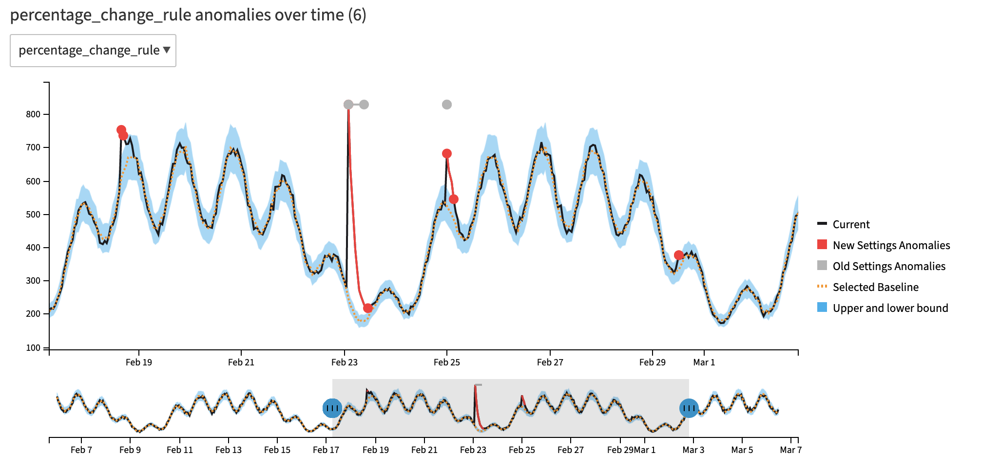

# ThirdEye

ThirdEye started as an anomaly detection and root-cause analysis tool on top of Apache Pinot and has since evolved into a platform that covers numerous use-cases ranging from system metric monitoring, over business reporting, to replacing offline war rooms. In one sentence:

> ThirdEye is a self-service experience enabling anyone in the organization to efficiently identify and investigate deviations in business and system metrics.

See more information in the ThirdEye documents [here](https://thirdeye.readthedocs.io/en/latest/introduction.html).

## Prepare Your Data \(optional\)

When using **pinot-quickstart** you have the ability to generate and load sample data into Apache Pinot for demo purposes. You can load them as follows and analyze them with ThirdEye or any of the other tools, such as [Superset](superset.md) and [Presto](presto.md).

If you want to use your own Pinot instance or go ahead without launching pinot at all, you can skip this section and to go straight to starting ThirdEye.

```text
docker container exec -it pinot-quickstart bin/generator.sh simpleWebsite
docker container exec -it pinot-quickstart bin/generator.sh complexWebsite
```

The **simpleWebsite** data set simulates three metrics of an imaginary website: views, clicks, and errors.

The **complexWebsite** data set has a similar setup, however, it generates dimensional data with breakdowns per country, platform, and browser. Also, because life is complex, there are outliers and anomalies in some of the metrics. Fortunately, ThirdEye is just the right tool to find and analyze those.

You can check if it worked by visiting Pinot's query console at [http://localhost:9000/query\#](http://localhost:9000/query#). If you see the data set names listed in the sidebar to the left, you're all set

## Start ThirdEye

Start the [ThirdEye image](https://hub.docker.com/r/apachepinot/thirdeye) with built-in Pinot connector. Or set it up ThirdEye stand-alone and let it make up some data all by itself.



Run the command below to start a ThirdEye instance that connects with Pinot:

```text
docker run \                                                  
    --network=pinot-demo \
    --name thirdeye \
    -p 1426:1426 \
    -p 1427:1427 \
    -d apachepinot/thirdeye:latest pinot-quickstart
```

If you're using the **pinot-quickstart** Docker image, ThirdEye will automatically connect to your instance and load all available data sets.



Run the command below to start a ThirdEye instance in stand-alone mode that generates it's own \(ephemeral\) mock time series data. This is nice for initially exploring ThirdEye and having a portable demo, but not very useful long-term.

```text
docker run \                                                  
    --network=pinot-demo \
    --name thirdeye \
    -p 1426:1426 \
    -p 1427:1427 \
    -d apachepinot/thirdeye:latest ephemeral
```



That's it. Now you can go to [http://localhost:1426/](http://localhost:1426/) and log in with username "sa" and password "sa".

## Explore Your Data

Click the **Root Cause Analysis** tab on the blue navigation bar on top and enter a metric name to start investigating your data. ThirdEye provides time series slice-and-dice and on-demand anomaly detection at interactive speeds. Go ahead and poke holes in your data sets - and then save and share your findings.

If you're running with **pinot-quickstart** and previously loaded the simpleWebsite and complexWebsite sample data set, type "simple" or "complex" into the search bar and auto-complete will show you the available metrics. If you're using the **ephemeral** configuration, try "tracking" or "business" instead.


If you don't have any data loaded into Pinot yet, you can generate neat-looking mock time series like the ones above with the pinot-admin data generator. If you're using the ThirdEye Docker image in stand-alone mode, you're already enjoying synthetic data anyways.

## Set Up Alerts

In addition to exploration and visualization ThirdEye has extensive support for ongoing monitoring and alerting. To set up an alert click the "Create Alert" button on the right-hand side of the blue navigation bar on top. Configuration happens per YAML in two steps - once \(on top\) for the detection rule, and once \(on the bottom. Keep scrolling - it's a long page\) for the notification subscription rule. Either read through the comments provided or copy&paste the example below.

**Note:** the examples assume that you have loaded the complexWebsite sample data set since there aren't any outliers in simpleWebsite.

**Detection Configuration** \(top\):

```text
detectionName: "page_view_alert"
  description: "check for outliers in views"
  metric: views
  dataset: complexWebsite
  rules:
  - detection:
    - name: percentage_change_rule
      type: PERCENTAGE_RULE
      params:
        offset: median4w
        percentageChange: 0.10


```

Before moving on to the subscription config you can check out the neat "what you see is what you get" alert preview. Below the editor window you'll find an option to "\(Re-\)run preview". Select a larger time range like 30 days for better effect. You can zoom in and out and modify your config and observe the effect. It'll look something like this:



**Subscription Configuration** \(bottom\):

```text
subscriptionGroupName: test_subscription_group
application: test
subscribedDetections:
  - page_view_alert
alertSchemes:
  - type: EMAIL
    recipients:
      to: 
        - your-email@example.com
  fromAddress: alerts@localhost
active: true
referenceLinks: {}
```

Click "Create Alert" and you're done with the process. Whether you set up email notifications or not, you can always check the current status of the alert under the "Alerts" tab on the top navigation bar.


\(Disclaimer: ThirdEye is a third-party software that is not part of the Apache Software Foundation\).

