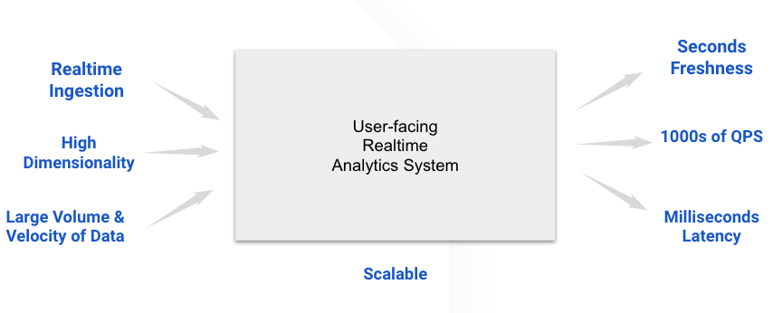

# Pushing the boundaries of Realtime Analytics

## User-facing Realtime analytics

### What is user-facing realtime analytics?

**User-facing analytics**, or site-facing analytics, is the **analytical tools and applications that you would expose directly to the end-users** of your product. In a user-facing analytics application, think of the user-base as ALL end users of an App. This App could be a social networking app, or a food delivery app - anything at all. It’s not just a few analysts doing offline analysis, or a handful of data scientists in a company running ad-hoc queries. This is ALL end-users, receiving personalized analytics on their personal devices \(**think 100s of 1000s of queries per second**\). These queries are triggered by apps, and not written by people, and so the scale will be as much as the active users on that App \(**think millions of events/sec**\)

And, this is for all the freshest possible data, which touches on the other aspect here - **realtime analytics**. "Yesterday" might be a long time ago for some businesses and they cannot wait for ETLs and batch jobs. The data needs to be used for analytics, as soon as it is generated \(**think latencies &lt; 1s**\).

### Why is user-facing realtime analytics is so challenging?

Wanting such a user-facing analytics application, using realtime events, sounds great. But what does it mean for the underlying infrastructure, to support such an analytical workload?

1. Such applications require the freshest possible data, and so the system needs to be able to **ingest data in realtime and make it available for querying, also in realtime**.
2. Data for such apps, tends to be event data, for wide range of actions, coming from multiple sources, and so the data comes in at a **very high velocity and tends to be highly dimensional**.
3. Queries are triggered by end-users interacting with apps - with **queries per second in hundreds of thousands**, with **arbitrary query patterns,** and **latencies are expected to be in milliseconds** for good user-experience. 
4. And further do all of the above, while being **scalable**, reliable, highly available and have a low cost to serve.

