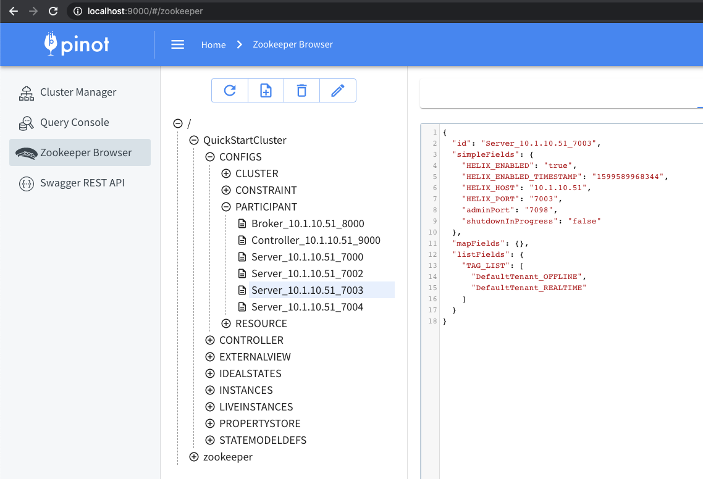
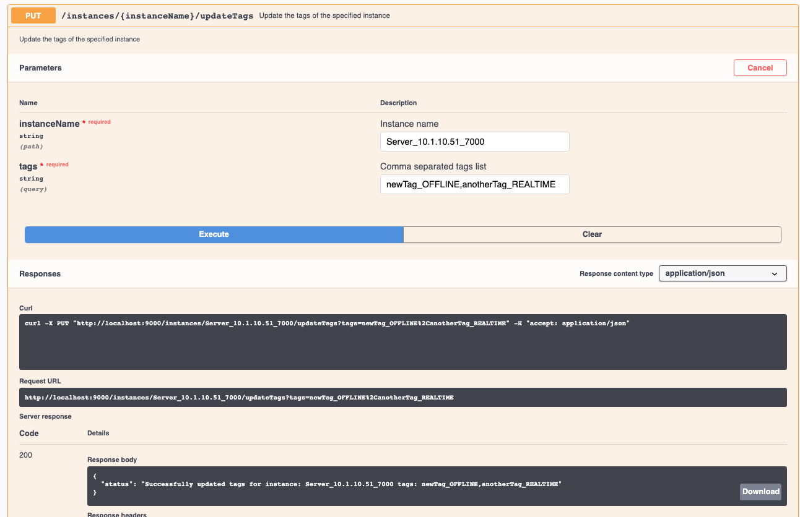

# Rebalance

Rebalance operation is used to balance the distribution of the segments amongst the servers being used by a Pinot table. 

## Changes that need to be followed by a rebalance 

Here's some common scenarios where the changes need to be followed by a rebalance.

1. Capacity changes
2. Increasing/decreasing replication for a table
3. Changing segment assignment for a table

### Capacity changes

These are typically done when downsizing/uplifting a cluster, or replacing nodes of a cluster.

#### Tenants and tags

Every server added to the Pinot server, has tags associated with it. A group of servers with the same tag forms a Tenant. By default, a server in the cluster gets added to the `DefaultTenant` i.e. gets tagged as `DefaultTenant_OFFLINE` and `DefaultTenant_REALTIME`. Below is an example of how this looks in the znode, as seen in ZooInspector.



A Pinot table config has a tenants section, to define the tenant to be used by the table. The Pinot table will use all the servers which belong to the tenant as described in this config. More details about this in the [Tenants](../../basics/components/tenant.md) section.

```text
 {   
    "tableName": "myTable_OFFLINE",
    "tenants" : {
      "broker":"DefaultTenant",
      "server":"DefaultTenant"
    }
  }
```

#### Updating tags

In order to change the server tags, the following API can be used.

`PUT /instances/{instanceName}/updateTags?tags=<comma separated tags>`



### Replication changes

In order to make change to the replication factor of a table, update the table config as follows

OFFLINE table - update the `replication` field

REALTIME table - update the `replicasPerPartition` field

### Segment Assignment changes 

The most common segment assignment change would be to move from the default segment assignment to replica group segment assignment. Discussing the details of the segment assignment is beyond the scope of this page. More details can be found in [Routing](tuning/routing.md#replica-group-segment-assignment-and-query-routing) and in this [FAQ question](../../basics/getting-started/frequent-questions.md#docs-internal-guid-3eddb872-7fff-0e2a-b4e3-b1b43454add3).

## Running a Rebalance

After any of the above described changes are done, a rebalance is needed to make those changes take effect.

To run a rebalance, use the following API. 

`POST /tables/{tableName}/rebalance?type=<OFFLINE/REALTIME>`


This API has a lot of knobs to control various behaviors. Make sure to go over them and change the defaults as needed.


**Note**

Typically, the flags that need to be changed from defaults are 

**includeConsuming=true** for REALTIME 

**downtime=true** if you have only 1 replica, or prefer faster rebalance at the cost of a momentary downtime


<table>
  <thead>
    <tr>
      <th style="text-align:left">Query param</th>
      <th style="text-align:left">Default value</th>
      <th style="text-align:left">Description</th>
    </tr>
  </thead>
  <tbody>
    <tr>
      <td style="text-align:left">dryRun</td>
      <td style="text-align:left">false</td>
      <td style="text-align:left">If set to true, <b>rebalance is run as a dry-run</b> so that you can see
        the expected changes to the ideal state and instance partition assignment.</td>
    </tr>
    <tr>
      <td style="text-align:left">includeConsuming</td>
      <td style="text-align:left">false</td>
      <td style="text-align:left">Applicable for REALTIME tables. <b>CONSUMING segments are rebalanced only if this is set to true</b>.
        <br
        />Moving a CONSUMING segment involves dropping the data consumed so far
        on old server, and re-consuming on the new server. If an application is
        sensitive to <b>increased memory utilization due to re-consumption or to a momentary data staleness</b>,
        they may choose to not include consuming in the rebalance. Whenever the
        CONSUMING segment completes, the completed segment will be assigned to
        the right instances, and the new CONSUMING segment will also be started
        on the correct instances. If you choose to includeConsuming=false and let
        the segments move later on, any downsized nodes need to remain untagged
        in the cluster, until the segment completion happens.</td>
    </tr>
    <tr>
      <td style="text-align:left">downtime</td>
      <td style="text-align:left">false</td>
      <td style="text-align:left">
        <p><b>This controls whether Pinot allows downtime while rebalancing.</b>
          <br
          />If downtime = true, all replicas of a segment can be moved around in one
          go, which could result in a momentary downtime for that segment (time gap
          between ideal state updated to new servers and new servers downloading
          the segments).
          <br />If downtime = false, Pinot will make sure to keep certain number of replicas
          (config in next row) always up. The rebalance will be done in multiple
          iterations under the hood, in order to fulfill this constraint.</p>
        <p><b>Note</b>: <em>If you have only 1 replica for your table,  rebalance with downtime=false is not possible.</em>
        </p>
      </td>
    </tr>
    <tr>
      <td style="text-align:left">minAvailableReplicas</td>
      <td style="text-align:left">1</td>
      <td style="text-align:left">
        <p>Applicable for rebalance with downtime=false.</p>
        <p>This is the <b>minimum number of replicas that are expected to stay alive</b> through
          the rebalance.</p>
      </td>
    </tr>
    <tr>
      <td style="text-align:left">bestEfforts</td>
      <td style="text-align:left">false</td>
      <td style="text-align:left">
        <p>Applicable for rebalance with downtime=false.</p>
        <p>If a no-downtime rebalance cannot be performed successfully, this flag <b>controls whether to fail the rebalance or do a best-effort rebalance</b>.</p>
      </td>
    </tr>
    <tr>
      <td style="text-align:left">reassignInstances</td>
      <td style="text-align:left">false</td>
      <td style="text-align:left">Applicable to tables where the instance assignment has been persisted
        to zookeeper. Setting this to true will make the rebalance <b>first update the instance assignment, and then rebalance the segments</b>.</td>
    </tr>
    <tr>
      <td style="text-align:left">bootstrap</td>
      <td style="text-align:left">false</td>
      <td style="text-align:left">Rebalances all segments again, <b>as if adding segments to an empty table</b>.
        If this is false, then the rebalance will try to minimize segment movements.</td>
    </tr>
  </tbody>
</table>

You can check the status of the rebalance by

1. Checking the controller logs
2. Running rebalance again after a while, you should receive status `"status": "NO_OP"`
3. Checking the External View of the table, to see the changes in capacity/replicas have taken effect.

