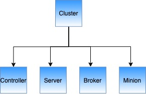
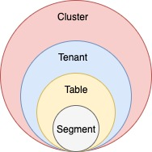

# Cluster

Cluster is a set a nodes comprising of servers, brokers, controllers and minions. 



Pinot leverages [Apache Helix](http://helix.apache.org/) for cluster management. Helix is a cluster management framework to manage replicated, partitioned resources in a distributed system. Helix uses Zookeeper to store cluster state and metadata.

### Cluster components

Briefly, Helix divides nodes into three logical components based on their responsibilities

#### Participant

The nodes that host distributed, partitioned resources

#### Spectator

The nodes that observe the current state of each Participant and use that information to access the resources. Spectators are notified of state changes in the cluster \(state of a participant, or that of a partition in a participant\).

#### Controller

The node that observes and controls the Participant nodes. It is responsible for coordinating all transitions in the cluster and ensuring that state constraints are satisfied while maintaining cluster stability_._

**Pinot Servers** are modeled as Participants, more details about server nodes can be found in [Server](server.md).   
**Pinot Brokers** are modeled as Spectators, more details about broker nodes can be found in [Broker](broker.md).   
**Pinot Controllers** are modeled as Controllers, more details about controller nodes can be found in [Controller](controller.md).

### Logical view

Another way to visualize the cluster is a logical view, wherein a cluster contains [tenants](tenant.md), tenants contain [tables](table.md), and tables contain [segments](segment.md).




## Setup a Pinot Cluster

Typically, there is only one cluster per environment/data center. There is no needed to create multiple Pinot clusters since Pinot supports the concept of [tenants](tenant.md). At LinkedIn, the largest Pinot cluster consists of 1000+ nodes.

To setup a Pinot cluster, we need to first start Zookeeper.



### 0. Create a Network

Create an isolated bridge network in docker

```text
docker network create -d bridge pinot-demo
```

### 1. Start Zookeeper

Start Zookeeper in daemon.

```text
docker run \
    --network=pinot-demo \
    --name pinot-zookeeper \
    --restart always \
    -p 2181:2181 \
    -d zookeeper:3.5.6
```

### 2. Start Zookeeper UI

Start  [ZKUI](https://github.com/DeemOpen/zkui) to browse Zookeeper data at [http://localhost:9090](http://localhost:9090).

```text
docker run \
	--network pinot-demo --name=zkui \
	-p 9090:9090 \
	-e ZK_SERVER=pinot-zookeeper:2181 \
	-d qnib/plain-zkui:latest
```



Download Pinot Distribution using instructions in [Download](https://apache-pinot.gitbook.io/apache-pinot-cookbook/getting-started/running-pinot-locally#download)

### 1. Start Zookeeper

```text
bin/pinot-admin.sh StartZookeeper -zkPort 2181
```

### 2. Start Zooinspector

Install [zooinspector](https://github.com/jfim/zooinspector) to view the data in Zookeeper, and connect to localhost:2181



Once we've started Zookeeper, we can start other components to join this cluster. If you're using docker, pull the latest `apachepinot/pinot` image. 



### Pull pinot docker image

You can try out pre-built Pinot all-in-one docker image.

```text
export PINOT_VERSION=0.3.0-SNAPSHOT
export PINOT_IMAGE=apachepinot/pinot:${PINOT_VERSION}
docker pull ${PINOT_IMAGE}
```

\(Optional\) You can also follow the instructions [here](../misc/build-docker-images.md) to build your own images.



To start other components to join the cluster 

1. [Start Controller](controller.md#starting-a-controller)
2. [Start Broker](broker.md#starting-a-broker)
3. [Start Server](server.md#starting-a-server)

Explore your cluster via [Pinot Data Explorer](../getting-started/exploring-pinot.md)


