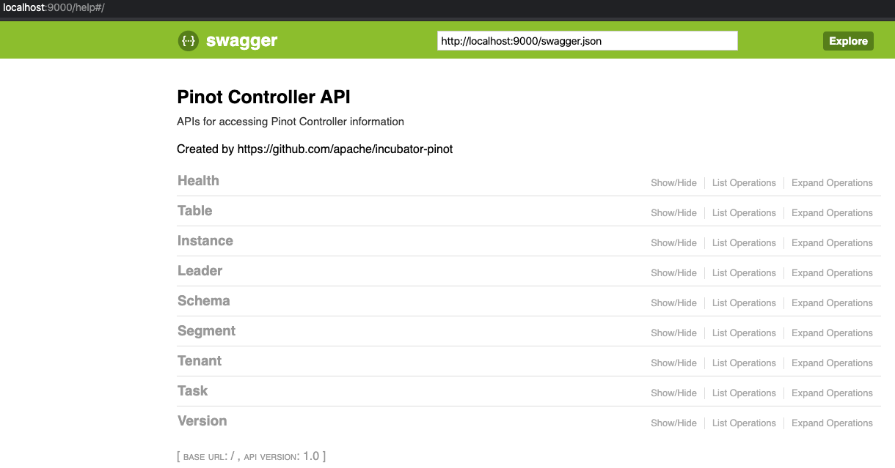
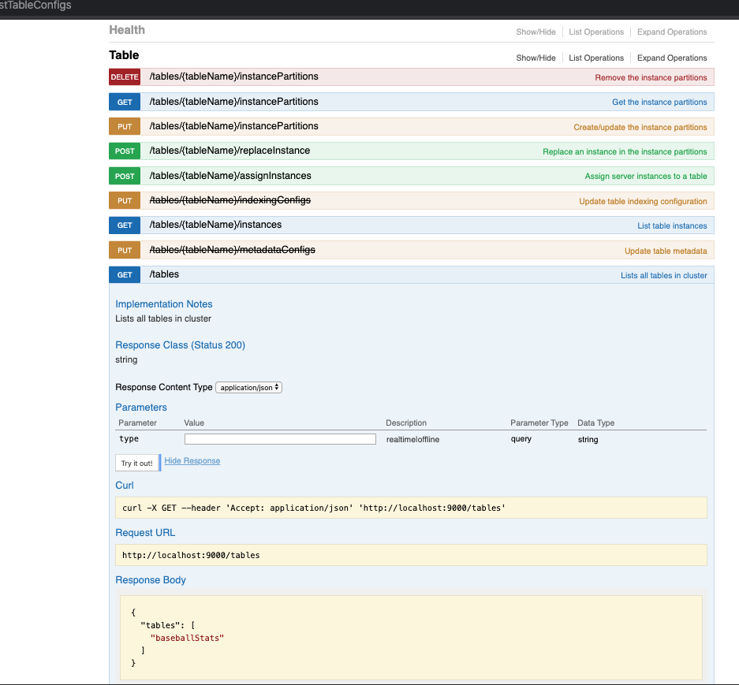

# Pinot Rest Admin Interface

The [Pinot Admin UI](http://localhost:9000/help) contains all the APIs that you will need to operate and manage your cluster. It provides a set of APIs for Pinot cluster management including health check, instances management, schema and table management, data segments management.



Let's check out the tables in this cluster by going to [Table -&gt; List all tables in cluster](http://localhost:9000/help#!/Table/listTableConfigs) and click on `Try it out!`. We can see the `baseballStats` table listed here. We can also see the exact `curl` call made to the controller API.



You can look at the configuration of this table by going to [Tables -&gt; Get/Enable/Disable/Drop a table](http://localhost:9000/help#!/Table/alterTableStateOrListTableConfig), type in `baseballStats` in the table name, and click `Try it out!`

Let's check out the schemas in the cluster by going to [Schema -&gt; List all schemas in the cluster](http://localhost:9000/help#!/Schema/listSchemaNames) and click `Try it out!`. We can see a schema called `baseballStats` in this list.


Take a look at the schema by going to [Schema -&gt; Get a schema](http://localhost:9000/help#!/Schema/getSchema), type `baseballStats` in the schema name, and click `Try it out!`.

```text
{
  "schemaName": "baseballStats",
  "dimensionFieldSpecs": [
    {
      "name": "playerID",
      "dataType": "STRING"
    },
    {
      "name": "yearID",
      "dataType": "INT"
    },
    {
      "name": "teamID",
      "dataType": "STRING"
    },
    {
      "name": "league",
      "dataType": "STRING"
    },
    {
      "name": "playerName",
      "dataType": "STRING"
    }
  ],
  "metricFieldSpecs": [
    {
      "name": "playerStint",
      "dataType": "INT"
    },
    {
      "name": "numberOfGames",
      "dataType": "INT"
    },
    {
      "name": "numberOfGamesAsBatter",
      "dataType": "INT"
    },
    {
      "name": "AtBatting",
      "dataType": "INT"
    },
    {
      "name": "runs",
      "dataType": "INT"
    },
    {
      "name": "hits",
      "dataType": "INT"
    },
    {
      "name": "doules",
      "dataType": "INT"
    },
    {
      "name": "tripples",
      "dataType": "INT"
    },
    {
      "name": "homeRuns",
      "dataType": "INT"
    },
    {
      "name": "runsBattedIn",
      "dataType": "INT"
    },
    {
      "name": "stolenBases",
      "dataType": "INT"
    },
    {
      "name": "caughtStealing",
      "dataType": "INT"
    },
    {
      "name": "baseOnBalls",
      "dataType": "INT"
    },
    {
      "name": "strikeouts",
      "dataType": "INT"
    },
    {
      "name": "intentionalWalks",
      "dataType": "INT"
    },
    {
      "name": "hitsByPitch",
      "dataType": "INT"
    },
    {
      "name": "sacrificeHits",
      "dataType": "INT"
    },
    {
      "name": "sacrificeFlies",
      "dataType": "INT"
    },
    {
      "name": "groundedIntoDoublePlays",
      "dataType": "INT"
    },
    {
      "name": "G_old",
      "dataType": "INT"
    }
  ]
}
```

Finally, let's checkout the data segments in the cluster by going to [Segment -&gt; List all segments](http://localhost:9000/help#!/Segment/getSegments), type in `baseballStats` in the table name, and click `Try it out!`. There's 1 segment for this table, called `baseballStats_OFFLINE_0`.

You might have figured out by now, in order to get data into the Pinot cluster, we need a table, a schema and segments. Let's head over to [Batch upload sample data](../../basics/getting-started/pushing-your-data-to-pinot.md), to find out more about these components and learn how to create them for your own data.

